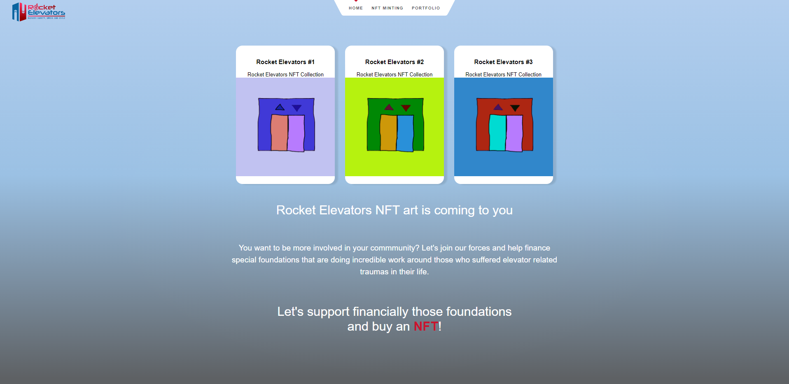
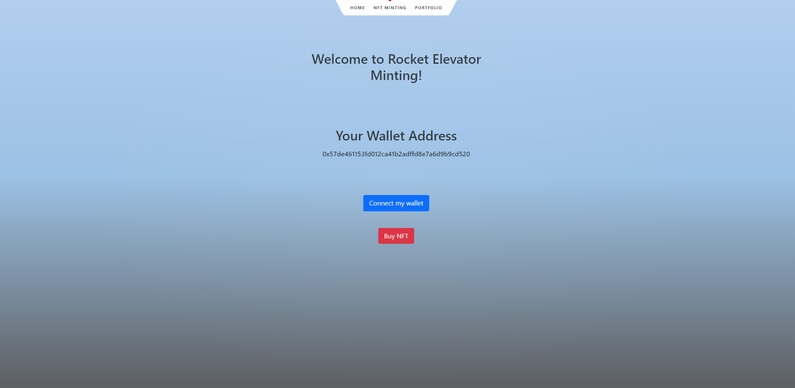

ROCKET_ELEVATORS_SVELTE_APPLICATION

This week's project is the introduction of Rocket Elevators to the world of NFTs !

A web application, created with Svelte, is allowing the customer of Rocket Elevator to fund special foundations helping with elevators traumas.

The app is deployed on Vercel at the followinf address : https://rocket-elevators-svelte-application-2kzy4aiu2-btbdev.vercel.app/

On the minting page, the customer is invited to connected is wallet (Metamask) and will be able to buy NFTs with Rocket Elevators tokens.

| Home |



| NFT Minting |



| Portfolio |


Below, you will find the most important NPM commands to use the application.

# create-svelte

Everything you need to build a Svelte project, powered by [`create-svelte`](https://github.com/sveltejs/kit/tree/master/packages/create-svelte).

## Creating a project

If you're seeing this, you've probably already done this step. Congrats!

```bash
# create a new project in the current directory
npm create svelte@latest

# create a new project in my-app
npm create svelte@latest my-app
```

## Developing

Once you've created a project and installed dependencies with `npm install` (or `pnpm install` or `yarn`), start a development server:

```bash
npm run dev

# or start the server and open the app in a new browser tab
npm run dev -- --open
```

## Building

To create a production version of your app:

```bash
npm run build
```

You can preview the production build with `npm run preview`.

> To deploy your app, you may need to install an [adapter](https://kit.svelte.dev/docs/adapters) for your target environment.
